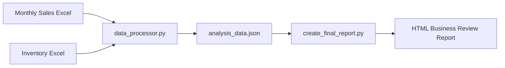
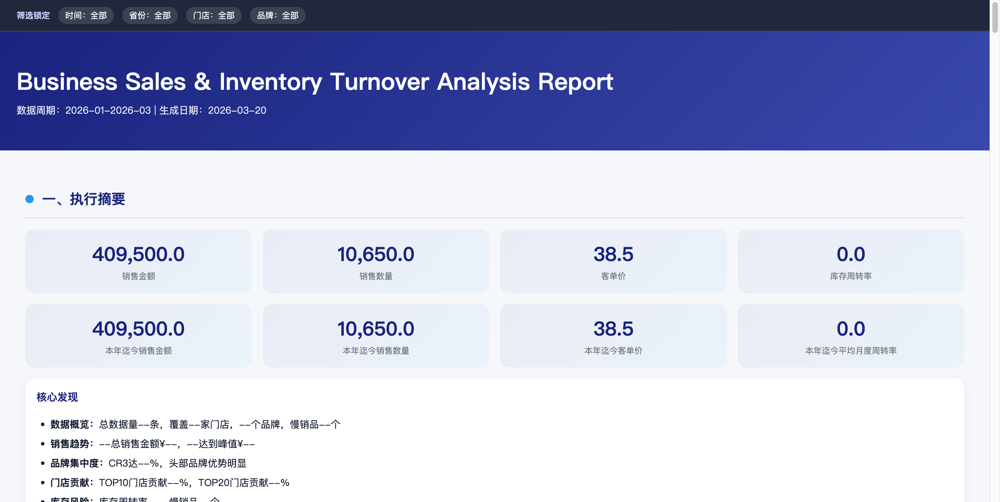
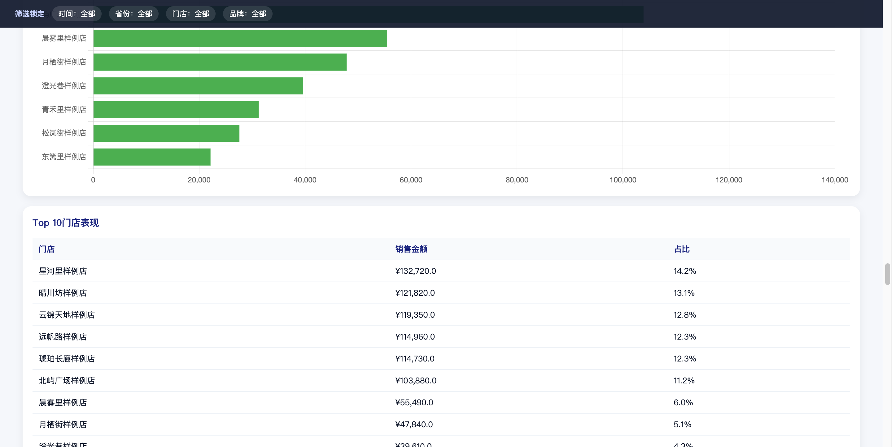

# Business Sales & Inventory Turnover Analysis

Generate HTML business review reports from monthly sales and inventory Excel files.

This repository contains the report pipeline, public template, and documentation. The public repo does not include real raw data or generated report output with business data.

## Example Workflow



## Features

- Process monthly sales and inventory Excel files into structured analysis data
- Generate a browser-friendly HTML report with charts, ranking tables, and inventory risk views
- Support multi-period analysis, brand/store/product breakdowns, and regional reporting
- Provide a public report template with sanitized sample data for preview and development

## Report Preview

The screenshots below are generated from the sanitized public template.

### Overview



### Detail View



## Quick Start

### 1. Prepare input files

- Put monthly sales files in `raw_data/`
- Put inventory files in `raw_data/`
- Update `config.yaml` if file names or thresholds differ from the defaults

### 2. Run the pipeline

macOS / Linux:

```bash
./run.sh
```

Windows:

```bat
run.bat
```

Manual mode:

```bash
python scripts/data_processor.py
python scripts/create_final_report.py
```

### 3. View the result

- Local generated report: `reports/report_with_data.html`
- Public example template: `reports/business_sales_inventory_report.html`

## Repository Layout

```text
pseudoctor-business-reviewer/
├── config.yaml
├── run.sh / run.bat
├── raw_data/                                  # Local input Excel files
├── data/
│   ├── analysis_data.json                     # Local generated analysis output (gitignored)
│   └── china_city_province.csv                # City-to-province mapping
├── scripts/
│   ├── data_processor.py                      # Analysis data pipeline
│   ├── create_final_report.py                 # HTML report builder
│   ├── common_data_utils.py                   # Shared data utilities
│   ├── benchmark_crossfilter_perf.py          # Frontend filter benchmark
│   ├── marketing_analysis_example.py          # Optional example script
│   └── marketing_analysis_template.py         # Optional example template
├── reports/
│   ├── business_sales_inventory_report.html   # Public template with sample data
│   └── report_with_data.html                  # Local generated report (gitignored)
├── docs/
│   ├── INTEGRATION_GUIDE.md
│   ├── images/
│   │   ├── report-overview.png
│   │   └── report-detail.png
│   └── report_template_specification.md
└── README.md
```

## Documentation

- `docs/INTEGRATION_GUIDE.md`: integration notes and workflow details
- `docs/report_template_specification.md`: report structure, metrics, and presentation rules

## Key Metrics

| Metric | Formula |
|--------|---------|
| Sales Amount | SUM(sales_amount of all records) |
| Sales Quantity | SUM(sales_quantity of all records) |
| Average Transaction Value (ATV) | Sales Amount / Sales Quantity |
| Inventory Turnover Rate | Monthly Sales Quantity / Inventory Quantity |
| Inventory / Sales Ratio | Inventory Quantity / Average Sales of Past 3 Months |

## Risk Levels

| Risk Level | Inventory / Sales Ratio | Color |
|-----------|--------------------------|-------|
| High Risk | ≥ 20 | Red |
| Medium Risk | 5 ≤ ratio < 20 | Yellow |
| Low Risk | < 5 | Green |

## Tech Stack

- Python
- Pandas
- Chart.js
- HTML / CSS / JavaScript

## Public Repo Notes

- `raw_data/` is local-only and should not be committed
- `data/analysis_data.json` is generated locally and gitignored
- `reports/report_with_data.html` is generated locally and gitignored
- The committed template and screenshots use sanitized sample data only
